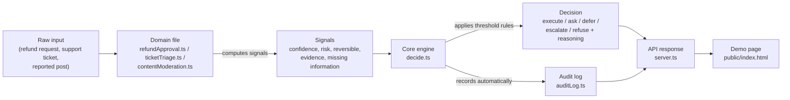

# Architecture

## Flow: inputs → signals → decision → audit

## What each stage does

**1. Raw input.** Someone (or something) proposes an action: "approve this $250 refund," "handle this support ticket," "remove this reported post." This is real-world, domain-specific data — nothing about confidence or risk yet.

**2. Domain file.** Exactly one file per domain (`refundApproval.ts`, `ticketTriage.ts`, `contentModeration.ts`). Its only job is to look at the raw input and calculate: how confident are we, how risky is this, can it be undone, what evidence supports the call, and what's missing. Each domain has its own rules for this — a refund's risk depends on amount and refund history; a ticket's risk depends on urgency keywords and customer tier.

**3. Signals.** A shared, domain-agnostic shape (`confidence`, `risk`, `reversible`, `evidence`, `missingInfo`) that every domain produces. This is the "interface" between the specific situation and the general-purpose engine.

**4. Core engine (`decide.ts`).** The only place that actually decides. It never touches a refund, a ticket, or a post — it only ever looks at signals, and applies the same threshold-based reasoning no matter which domain sent them. This is what makes it a genuine decision *layer*, not three separate scripts that happen to share a folder.

**5. Decision.** One of `execute`, `ask`, `defer`, `escalate`, or `refuse`, plus a plain-English `reasoning` string explaining exactly why.

**6. Audit log.** Every decision — regardless of domain or outcome — is automatically recorded the moment `decide()` returns, with a timestamp and the full decision object. Nothing bypasses this: a domain file cannot skip logging even if it wanted to, because the recording happens inside the shared engine, not inside each domain.

**7. API + demo page.** `server.ts` exposes each domain as an endpoint and the audit log as its own endpoint. `public/index.html` is a thin client that calls these endpoints and displays the result — it contains no decision logic of its own.

## Why this shape

Adding a fourth domain (say, "loan approval") means writing one new file that produces the same 5 signals — zero changes to `decide.ts`, `auditLog.ts`, or the audit trail. The core engine, the safety guarantees, and the audit trail are reused automatically. That reusability is the actual point of a decision *layer* rather than a decision *script*.